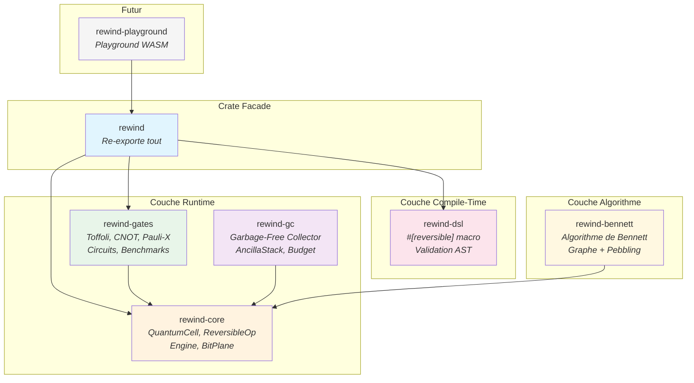
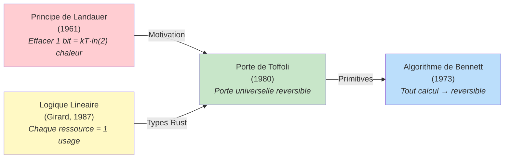
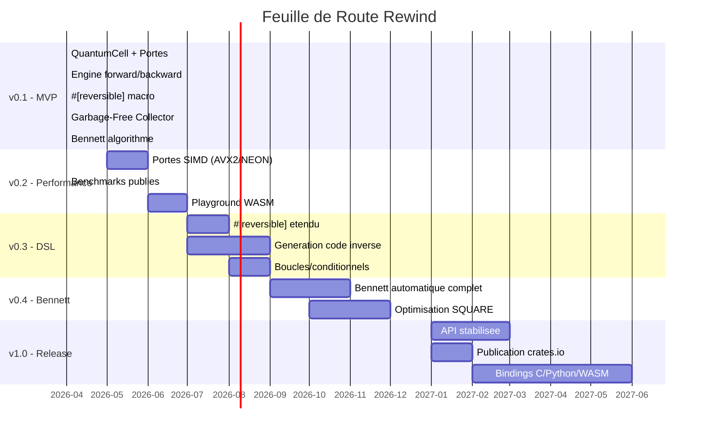

# Rewind

<p align="center">
  
</p>

[](https://github.com/CTC-Kernel/aion-os/actions/workflows/ci.yml)
[](LICENSE-MIT)
[](https://www.rust-lang.org/)
[](#)
[](#architecture)

**Le premier SDK de calcul nativement reversible pour Rust.**

> *L'information est sacree - elle ne doit jamais etre detruite.*
Le Problème Universel : La Mort Thermique de l'Information
Toute l'informatique actuelle (du supercalculateur à ton iPhone) repose sur la dissipation de chaleur. Pour effacer un bit ou traiter une donnée, on consomme de l'énergie et on crée du désordre (entropie). C'est la limite de Landauer. À cause de cela, l'IA finira par consommer plus d'énergie que la Terre ne peut en produire.

💡 L'Invention : Le Calcul Réversible et Topologique
Aion-OS est un noyau écrit en Rust conçu pour piloter des processeurs de nouvelle génération (adiabatiques ou topologiques). Au lieu d'exécuter des instructions qui "consomment" des données, Aion-OS traite l'information comme un flux continu et réversible.

Ce qui en fait une Révolution Historique :

Consommation d'Énergie Quasi-Nulle : En théorie, un calcul réversible ne dégage aucune chaleur. Tu pourrais faire tourner l'équivalent de l'intelligence humaine sur une pile bouton pendant 10 ans.

L'Ordinateur "Immunitaires" : Le noyau utilise des algorithmes de Logique Linéaire (poussés à l'extrême via le système de types de Rust) pour s'auto-réparer. Si un bit est corrompu par un rayon cosmique, la structure mathématique du langage force le bit à revenir à son état correct par symétrie.

L'Unification Quantique-Classique : Aion-OS est le premier système capable de gérer des registres classiques et des qubits dans le même espace d'adressage, permettant de résoudre des problèmes de chimie ou de physique impossibles aujourd'hui (création de nouveaux matériaux, remèdes contre le cancer en quelques secondes de calcul).
---

## Qu'est-ce que Rewind ?

Rewind est un SDK qui garantit que **chaque operation peut etre defaite**. Contrairement aux debuggers classiques qui enregistrent des traces (rr, UndoDB), Rewind rend le calcul lui-meme structurellement inversible - verifie a la compilation, sans overhead d'enregistrement.

```
         FORWARD                          BACKWARD
   ┌──────────────────┐            ┌──────────────────┐
   │  R0 = 0x0A       │            │  R0 = 0x14       │
   │  R1 = 0x14       │            │  R1 = 0xF5       │
   │                   │            │                   │
   │  NOT R0           │            │  undo CNOT R1→R2  │
   │  CNOT R0→R1       │   rewind  │  undo TOFF        │
   │  TOFF R0,R1→R2    │ ◄──────── │  undo CNOT R0→R1  │
   │  CNOT R1→R2       │           │  undo NOT R0       │
   │                   │            │                   │
   │  R0 = 0x14        │            │  R0 = 0x0A       │
   │  R1 = 0xF5        │            │  R1 = 0x14       │
   └──────────────────┘            └──────────────────┘
         Chaque etat est restaure parfaitement.
```

<p align="center">
  
</p>

### Pourquoi c'est different ?

| | Rewind | rr / UndoDB | Debugger classique |
|---|--------|-------------|-------------------|
| **Methode** | Calcul nativement inversible | Enregistrement + replay | Logs / breakpoints |
| **Overhead** | Zero enregistrement | 1.2-5x slowdown | Aucun |
| **Verification** | Compile-time (`#[reversible]`) | Aucune | Aucune |
| **Multi-usage** | Debug + rollback + fuzzing + securite | Debug seulement | Debug seulement |
| **Correctness** | Prouve par proptest (`undo(exec(x)) == x`) | Non verifie | Non verifie |

---

## Architecture

Le SDK est compose de 7 crates modulaires dans un workspace Cargo :



### Decisions Architecturales

| Decision | Choix | Justification |
|----------|-------|---------------|
| Structure | Workspace multi-crate | Modulaire, chaque crate publiable independamment |
| Memoire | Arena allocator + indices types | Plus performant que `Pin<Box<T>>`, cache-friendly |
| Dispatch VM | `match` sur enum d'opcodes | Quasi-optimal sur CPU modernes (branch predictor) |
| Layout bits | Structure of Arrays (SoA) | Optimal pour parallelisation SIMD future |
| Types lineaires | `Drop` + panic + `ManuallyDrop` | Seule approche viable en Rust stable |
| Features | `simd`, `stable-simd`, `bennett` | Opt-in, le core compile partout |

---

## Guide de Demarrage Rapide

### Installation

```bash
git clone https://github.com/CTC-Kernel/aion-os.git
cd aion-os
cargo build
cargo test   # 134 tests doivent passer
```

### Premier Programme Reversible

```rust
use rewind::prelude::*;

fn main() {
    // Creer 2 registres
    let mut rt = ReversibleRuntime::new(vec![
        BitPlane::from_words(vec![42]),   // R0 = 42
        BitPlane::from_words(vec![0]),    // R1 = 0
    ]);

    // Executer des operations (trackees automatiquement)
    rt.execute_tracked(Op::Not(0));                              // R0 = NOT R0
    rt.execute_tracked(Op::Cnot { control: 0, target: 1 });     // R1 ^= R0

    println!("Apres forward: R0={}, R1={}",
        rt.register(0).words()[0],
        rt.register(1).words()[0]);

    // Rembobiner — restaure l'etat original
    rt.rewind_all().unwrap();

    assert_eq!(rt.register(0).words()[0], 42);  // Restaure !
    assert_eq!(rt.register(1).words()[0], 0);   // Restaure !
    assert!(rt.is_garbage_free());               // Zero dechet
}
```

### Exemples Disponibles

```bash
# Execution forward/backward basique
cargo run -p rewind --example hello_rewind

# Time-travel debugging avec trace pas-a-pas
cargo run -p rewind --example time_travel_debug

# Checkpoint et restauration d'etat
cargo run -p rewind --example step_backward

# Type lineaire QuantumCell
cargo run -p rewind --example quantum_cell

# Circuits reversibles (additionneur, swap)
cargo run -p rewind --example reversible_adder

# API unifiee ReversibleRuntime
cargo run -p rewind --example runtime_demo
```

---

## Composants Principaux

### QuantumCell — Type Lineaire

Un type qui **doit** etre consomme exactement une fois. Le dropper sans le consommer = panic.

```rust
use rewind_core::QuantumCell;

let mut cell = QuantumCell::new(42u64);

// Inspecter sans consommer
println!("{}", cell.get());      // OK
*cell.get_mut() += 10;           // Modification en place

// Consommer — seule sortie possible
let value = cell.consume();      // OK, retourne 52
// Si on oublie consume() :
// let _leak = QuantumCell::new(99);
// → panic!("QuantumCell dropped without being consumed — information lost")
```

<p align="center">
  
</p>

```mermaid
stateDiagram-v2
    [*] --> Cree: QuantumCell::new(value)
    Cree --> Emprunte: .get() / .get_mut()
    Emprunte --> Cree: retour du borrow
    Cree --> Consomme: .consume()
    Consomme --> [*]: valeur retournee
    Cree --> PANIC: drop sans consume
    PANIC --> [*]: information lost!
```

### Portes Reversibles

Trois portes universelles — suffisantes pour tout calcul reversible classique :

| Porte | Operation | Inverse | Universelle ? |
|-------|-----------|---------|---------------|
| **Pauli-X** (NOT) | `bits = NOT bits` | Elle-meme (auto-inverse) | Non |
| **CNOT** | `target ^= control` | Elle-meme (auto-inverse) | Non |
| **Toffoli** (CCNOT) | `target ^= (c1 AND c2)` | Elle-meme (auto-inverse) | **Oui** |

```rust
use rewind_core::{BitPlane, ReversibleOp, assert_reversible};
use rewind_gates::scalar::{Toffoli, ToffoliState};

let state = ToffoliState {
    control1: BitPlane::from_words(vec![0xFF]),
    control2: BitPlane::from_words(vec![0x0F]),
    target: BitPlane::from_words(vec![0x00]),
};

let (output, ancilla) = Toffoli.execute(state.clone());
let restored = Toffoli.undo(output, ancilla);
assert_eq!(state, restored); // Parfaitement reversible

// Proptest verifie ceci pour des MILLIERS d'inputs aleatoires
assert_reversible(&Toffoli, state);
```

### Circuits Pre-Construits

```rust
use rewind_gates::circuits;
use rewind::prelude::*;

// Demi-additionneur reversible
let ops = circuits::half_adder(0, 1, 2);

// SWAP via 3 CNOTs
let ops = circuits::swap(0, 1);

// Composition de circuits
let combined = circuits::compose(vec![
    circuits::swap(0, 1),
    vec![Op::Not(0)],
    circuits::swap(0, 1),
]);

// Inversion d'un circuit
let inverse = circuits::reverse(&combined);
```

### Macro `#[reversible]`

Verifie a la compilation que votre code est reversible :

```rust
use rewind_dsl::reversible;

#[reversible]
fn calcul_sur(x: &mut u64, y: &mut u64) {
    *x += 42;       // OK — inverse: -= 42
    *y ^= *x;       // OK — XOR est auto-inverse

    // *x = 0;       // ERREUR COMPILATION: "destructive assignment —
    //               //   this overwrites information. Use +=, -=, or ^= instead"

    // println!();    // ERREUR COMPILATION: "I/O is an irreversible side effect"

    // std::mem::forget(x);  // ERREUR COMPILATION: "mem::forget bypasses
    //                       //   Drop and destroys information"
}
```

### Garbage-Free Collector

Au lieu de liberer la memoire (ce qui detruit de l'information), le GC "de-calcule" les etapes intermediaires :

```rust
use rewind_gc::{GarbageFreeCollector, MemoryBudget};
use rewind_core::BitPlane;

let mut gc = GarbageFreeCollector::new(MemoryBudget::new(1024)); // 1 KB max

// Forward : sauvegarder les etats intermediaires
gc.checkpoint_ancilla(BitPlane::from_words(vec![0xAA])).unwrap();
gc.checkpoint_ancilla(BitPlane::from_words(vec![0xBB])).unwrap();

// Backward : restaurer en LIFO
let restored = gc.uncompute().unwrap(); // 0xBB
let restored = gc.uncompute().unwrap(); // 0xAA

// Verifier : zero dechet
assert!(gc.is_garbage_free());
```

### Time-Travel Debugging

Le coeur de Rewind — observer chaque changement d'etat, puis rembobiner pas a pas :

```rust
use rewind::prelude::*;

let mut rt = ReversibleRuntime::new(/* registers */);

// Executer avec trace : chaque pas appelle le callback
rt.execute_traced(&program, |step, op, regs| {
    println!("Step {}: {:?} → R0={:X}", step, op, regs[0]);
});

// Rembobiner avec trace : chaque undo appelle le callback
rt.rewind_traced(n, |step, op, regs| {
    println!("Undo {}: {:?} → R0={:X}", step, op, regs[0]);
}).unwrap();
```

---

## Fondations Theoriques

Rewind repose sur quatre piliers scientifiques prouves :



<p align="center">
  
</p>

| Fondation | Annee | Contribution | Confiance |
|-----------|-------|-------------|-----------|
| **Principe de Landauer** | 1961 | Effacer un bit dissipe kT·ln(2) de chaleur — prouve physiquement | Verifie experimentalement |
| **Porte de Toffoli** (CCNOT) | 1980 | Porte universelle : tout circuit classique reversible peut etre construit uniquement avec des Toffoli | Prouve mathematiquement |
| **Algorithme de Bennett** | 1973 | N'importe quel calcul irreversible peut etre transforme en reversible (avec trade-off espace/temps) | Prouve mathematiquement |
| **Logique Lineaire** (Girard) | 1987 | Chaque hypothese utilisee exactement une fois — correspond aux types affines de Rust | Base theorique de QuantumCell |

**Pourquoi Rust ?** Le systeme d'ownership de Rust (move semantics, borrow checker) est une implementation native de la logique lineaire. C'est le seul langage mainstream ou construire un SDK de calcul reversible est *naturel* plutot que force.

---

## Performance

Throughput mesure des portes Toffoli (scalaire, Apple Silicon) :

| Mots (u64) | Bits | Temps | Throughput |
|------------|------|-------|-----------|
| 1 | 64 | 74 ns | ~860M portes/sec |
| 16 | 1,024 | 84 ns | ~12B bit-ops/sec |
| 256 | 16,384 | 239 ns | ~68B bit-ops/sec |
| 1,024 | 65,536 | 700 ns | **~93B bit-ops/sec** |

```bash
# Lancer les benchmarks
cargo bench -p rewind-gates
```

> Les optimisations SIMD (AVX2/AVX-512/NEON) sont prevues pour la v0.2 et multiplieront ces chiffres par 4-8x.

---

## Crates

| Crate | Description | Fichiers cles |
|-------|-------------|---------------|
| [`rewind`](rewind/) | Facade — re-exporte tout + prelude | `lib.rs` |
| [`rewind-core`](rewind-core/) | Types fondamentaux + moteur d'execution | `cell.rs`, `engine.rs`, `runtime.rs`, `traits.rs`, `bitplane.rs` |
| [`rewind-gates`](rewind-gates/) | Portes logiques + circuits | `scalar.rs`, `circuits.rs` |
| [`rewind-gc`](rewind-gc/) | Garbage-Free Collector | `collector.rs`, `stack.rs`, `budget.rs` |
| [`rewind-dsl`](rewind-dsl/) | Macro `#[reversible]` | `lib.rs`, `validate.rs` |
| [`rewind-bennett`](rewind-bennett/) | Algorithme de Bennett | `graph.rs`, `pebbling.rs`, `executor.rs` |
| [`rewind-playground`](rewind-playground/) | Playground WASM (prevu) | — |

---

## Guide du Contributeur

```bash
# Cloner et compiler
git clone https://github.com/CTC-Kernel/aion-os.git
cd aion-os
cargo build

# Lancer les tests (150 tests doivent passer)
cargo test

# Verifier le style
cargo clippy -- -D warnings
cargo fmt --all -- --check

# Generer la documentation
cargo doc --no-deps --open

# Benchmarks
cargo bench -p rewind-gates
```

### Regles de Contribution

1. **Toute implementation de `ReversibleOp` DOIT avoir un test proptest** verifiant `undo(execute(x)) == x`
2. **Zero `unsafe` dans le code utilisateur** sans justification ecrite
3. **Tous les items publics** doivent avoir un doc comment avec exemple
4. **`cargo clippy -- -D warnings`** doit passer sans erreur
5. **`cargo fmt`** doit etre applique avant tout commit

Voir [CONTRIBUTING.md](CONTRIBUTING.md) pour plus de details.

---

## Feuille de Route



---

## Contexte et Motivation

### Le Probleme : L'Informatique Detruit de l'Information

Chaque `x = y` ecrase l'ancienne valeur de x. Chaque garbage collection efface des etats intermediaires. Cette destruction a un cout physique — le **principe de Landauer** prouve que chaque bit efface dissipe un minimum de **kT·ln(2) de chaleur** (verifie experimentalement).

Les data centers consomment deja **1.5% de l'electricite mondiale** et ce chiffre devrait tripler d'ici 2030 avec l'essor de l'IA. Les optimisations actuelles (quantization, MoE) sont incrementales — pas un changement de paradigme.

### La Solution : Le Calcul Reversible

Si chaque operation `f(x) = y` possede un inverse `f⁻¹(y) = x`, aucune information n'est perdue, et theoriquement, aucune chaleur n'est dissipee. C'est le **calcul reversible** — et c'est prouve possible par Bennett (1973).

**Vaire Computing** (UK) a demontre le premier chip CMOS reversible en 2025 avec 50% de recuperation d'energie. Le potentiel theorique est de **4,000x** d'efficacite energetique.

### Pourquoi Rewind Existe

Il y a un **vide strategique** entre la theorie academique (Janus, RevKit) et le hardware emergent (Vaire). **Personne ne construit la couche logicielle.** Rewind comble ce vide — un SDK moderne en Rust pour le calcul reversible, utilisable aujourd'hui comme debugger temporel, demain comme runtime pour chips reversibles.

---

## Licence

Double licence au choix :

- [Apache License 2.0](LICENSE-APACHE)
- [MIT License](LICENSE-MIT)

---

*Construit avec la conviction que l'information ne devrait jamais etre detruite.*

*Built with the conviction that information should never be destroyed.*

---

## Liens

| Document | Description |
|----------|-------------|
| [CHANGELOG.md](CHANGELOG.md) | Historique complet des changements |
| [CONTRIBUTING.md](CONTRIBUTING.md) | Guide de contribution |
| [SECURITY.md](SECURITY.md) | Politique de securite et signalement de vulnerabilites |
| [CODE_OF_CONDUCT.md](CODE_OF_CONDUCT.md) | Code de conduite |
| [project-context.md](project-context.md) | Contexte architectural pour les contributeurs IA/humains |
| [LICENSE-MIT](LICENSE-MIT) | Licence MIT |
| [LICENSE-APACHE](LICENSE-APACHE) | Licence Apache 2.0 |

---

<sub>

**Mots-cles** : reversible computing, calcul reversible, Rust SDK, Toffoli gate, CNOT, Pauli-X, time-travel debugging, debugger temporel, linear types, types lineaires, Bennett algorithm, Landauer principle, garbage-free computing, zero-entropy, information preservation, quantum computing, reversible virtual machine, RVM, proc-macro, compile-time verification, energy-efficient computing, green computing, Vaire Computing, adiabatic computing, SIMD, open source Rust

</sub>
